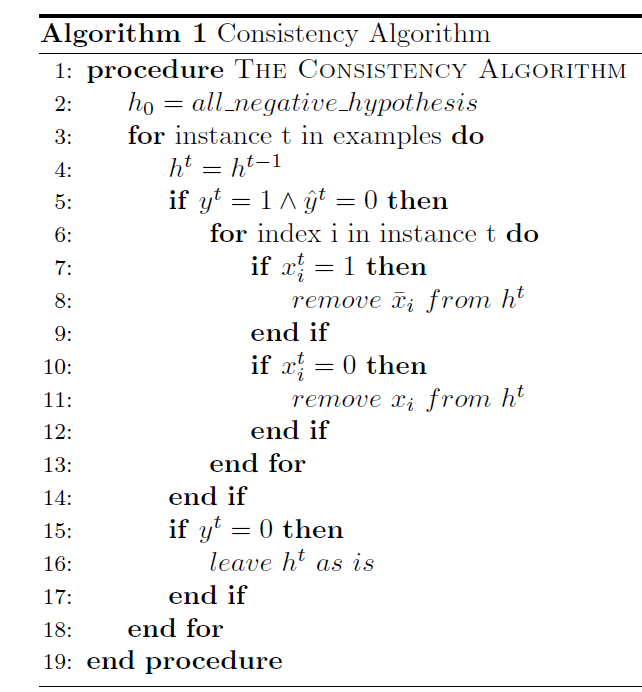

Implementation of Consistency Algorithm in Machine Learning course using python

Input data should be in the following format:

0 1 1 0 0
1 0 0 1 1
0 1 0 1 1

(input = [0, 1, 1, 0], label = 0)
(input = [1, 0, 0, 1], label = 1)
(input = [0, 1, 0, 1], label = 1)

Where each line is an example from the data, 4 inputs and 1 label
all the values are inputs except the last, the last one is a label for the input

Output would be:
not(x3),x4

or empty set ∅ if a conjunction does not fit the data.

Required:
1. Python 3.7
2. numpy
3. input file "data.txt" in directory

Instructions:

1. Open Command-prompt
2. $pip install numpy
2. $python ex1_main.py
